# 1 Завдання
## 1 приклад

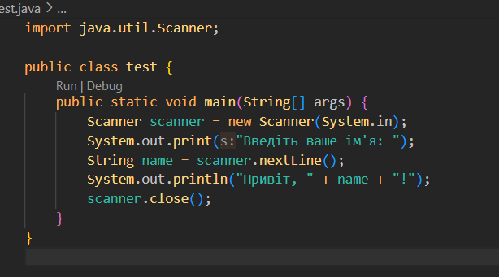
### запитує ім'я, а потім виводить результат

### результат
# 2 Завдання
## 1 приклад (Розробити клас, що серіалізується, для зберігання параметрів і результатів обчислень)
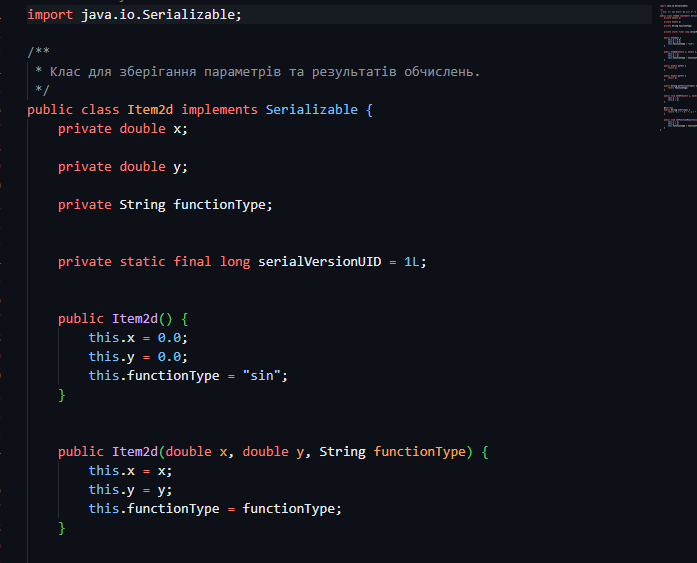
## 2 приклад (Клас для обчислення)
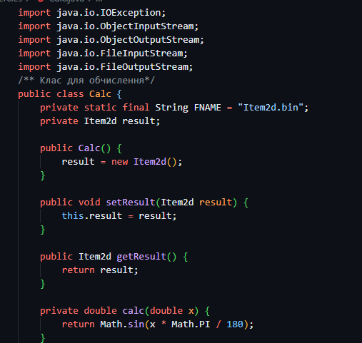
## 3 приклад (Розробити клас для демонстрації в діалоговому режимі збереження та відновлення стану об'єкта)
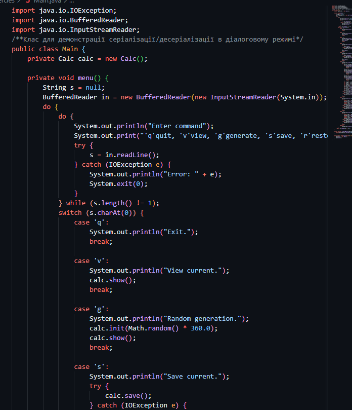
## 4 приклад (Розробити клас для тестування коректності результатів обчислень та серіалізації/десеріалізації)
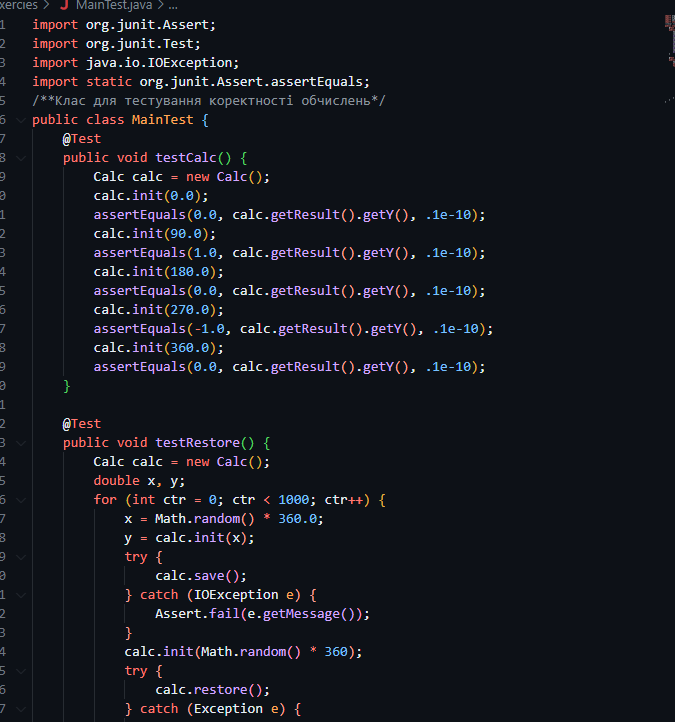
## 5 приклад (Визначити периметр, площу та об'єм приміщення за заданими двійковими значеннями довжини, ширини та висоти)
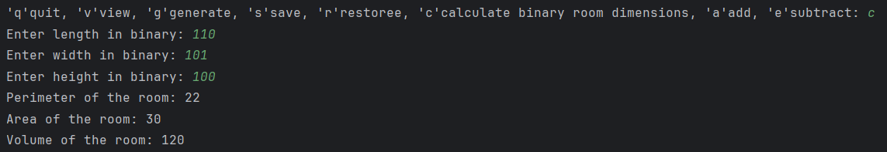
## 6 приклад (тестування)
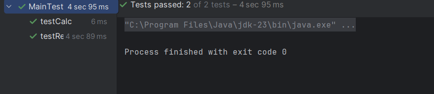

# 3 Завдання 
##  Calc.java Клас для обчислень, який використовує методи для обчислення значення функції
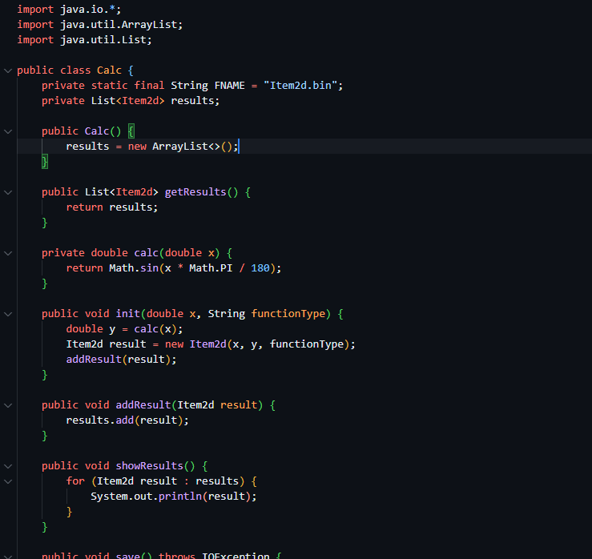
##   Item2d.java Клас для зберігання параметрів і результатів обчислень у вигляді об'єкта.
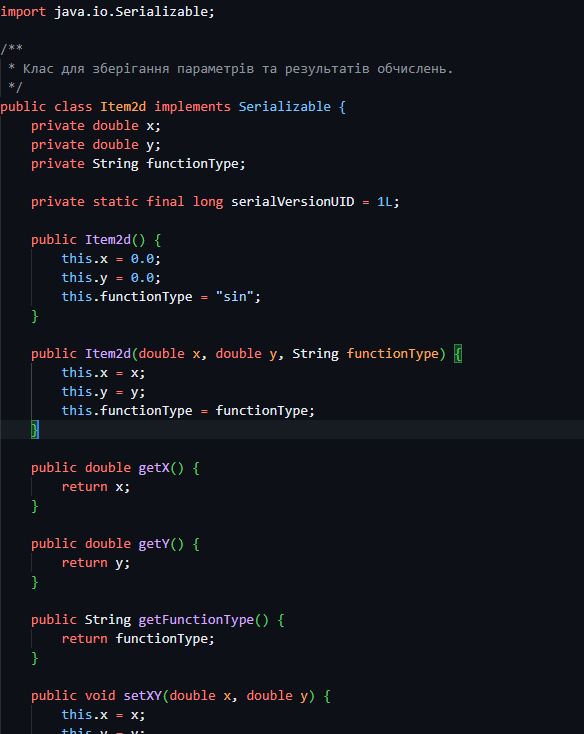
##   Main.java Клас для основної логіки програми, включаючи взаємодію з користувачем через консольне меню. 
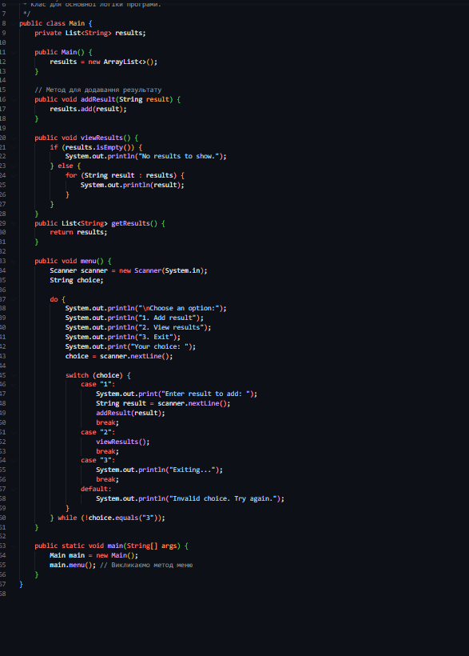
##   MainTest.java Клас для тестування основної функціональності програми. 
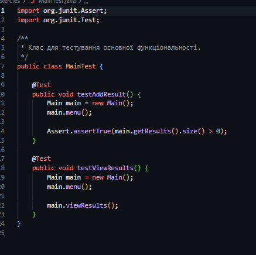
##   View.java Інтерфейс для класів, які відповідальні за відображення результатів. 
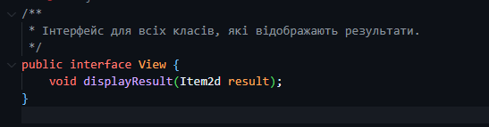
##  Viewable.java: Інтерфейс для фабрик, які створюють об'єкти для відображення результатів. 
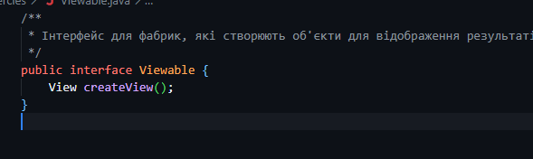
##  ViewResult.java Клас, який реалізує інтерфейс View і відповідає за текстове відображення результатів обчислень на екран.
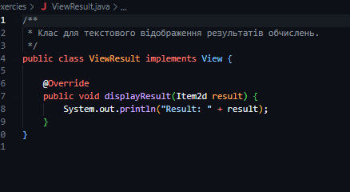
##  ViewableResult.java Клас, що реалізує інтерфейс Viewable і створює об'єкти ViewResult.
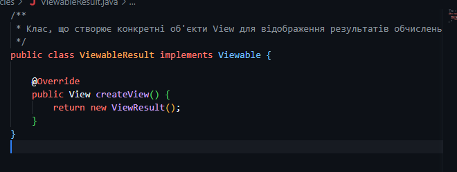