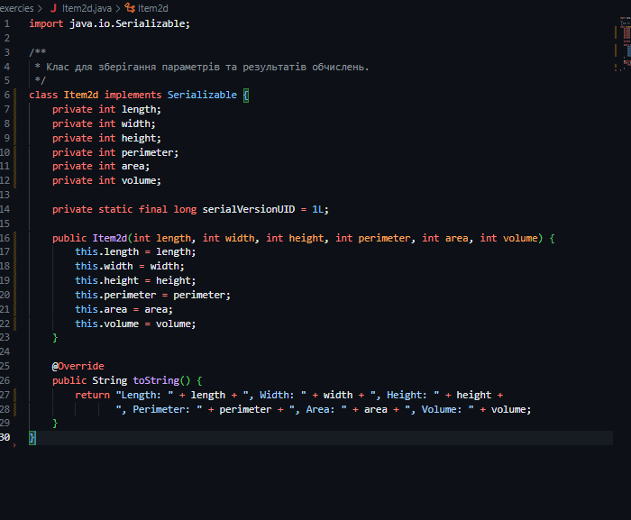
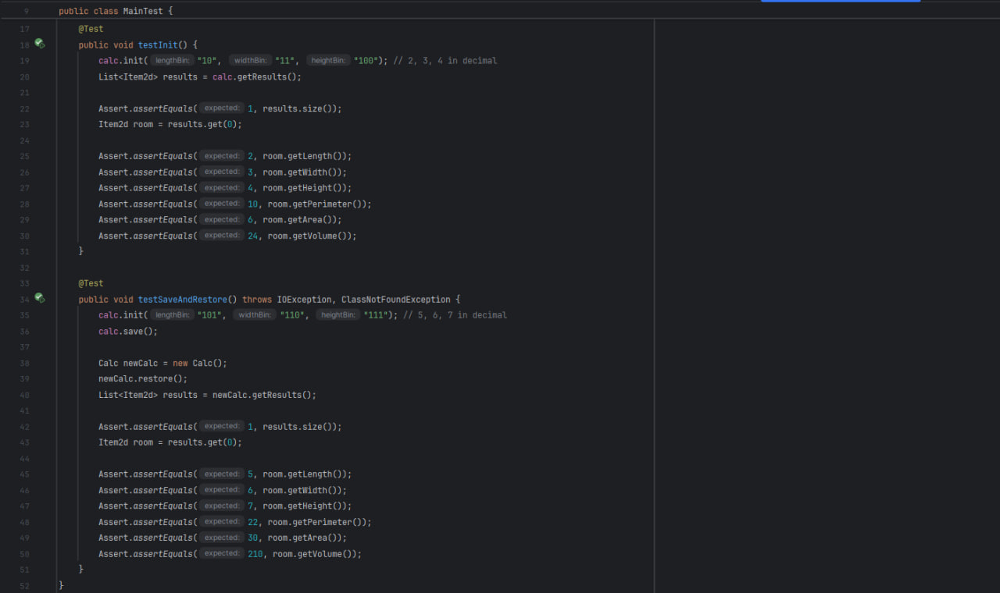

# 1 Завдання
## 1 приклад


### Програма запитує ім'я, а потім виводить результат

### результат
# 2 Завдання
## 1 приклад (Розробити клас, що серіалізується, для зберігання параметрів і результатів обчислень)
```java
public class Calc {
    private static final String FNAME = "Item2d.bin";
    private Item2d result;

    public Calc() {
        result = new Item2d();
    }

    public void setResult(Item2d result) {
        this.result = result;
    }

    public Item2d getResult() {
        return result;
    }

    private double calc(double x) {
        return Math.sin(x * Math.PI / 180);
    }

    public double init(double x) {
        result.setXY(x, calc(x));
        return result.getY();
    }

    public void show() {
        System.out.println(result);
    }

    public void save() throws IOException {
        try (ObjectOutputStream os = new ObjectOutputStream(new FileOutputStream(FNAME))) {
            os.writeObject(result);
            os.flush();
        }
    }

    public void restore() throws Exception {
        try (ObjectInputStream is = new ObjectInputStream(new FileInputStream(FNAME))) {
            result = (Item2d) is.readObject();
        }
    }
}
```
## 2 приклад (Клас для збереження вхідних даних та результатів обчислень.)
```java
public class Item2d implements Serializable {
    private double x;

    private double y;

    private String functionType;


    private static final long serialVersionUID = 1L;


    public Item2d() {
        this.x = 0.0;
        this.y = 0.0;
        this.functionType = "sin";
    }


    public Item2d(double x, double y, String functionType) {
        this.x = x;
        this.y = y;
        this.functionType = functionType;
    }


    public double getX() {
        return x;
    }


    public double getY() {
        return y;
    }


    public String getFunctionType() {
        return functionType;
    }


    public void setXY(double x, double y) {
        this.x = x;
        this.y = y;
    }


    @Override
    public String toString() {
        return "x = " + x + ", y = " + y + ", Function = " + functionType;
    }


    public void setFunctionResult(double x, double y, String functionType) {
        this.x = x;
        this.y = y;
        this.functionType = functionType;
    }
}
```
## 3 приклад (Розробити клас для демонстрації в діалоговому режимі збереження та відновлення стану об'єкта)

## 4 приклад (Визначити периметр, площу та об'єм приміщення за заданими двійковими значеннями довжини, ширини та висоти)

## 5 приклад (Тестування)


# 3 Завдання 
##  Javadoc документація.

##  Calc.java Клас для обчислень і логіки програми

##   Item2d.java Клас для зберігання параметрів і результатів обчислень у вигляді об'єкта.

##   Main.java Основний клас програми, відповідає за взаємодію з користувачем. 

##   MainTest.java Клас для тестування основної функціональності програми. 

##   View.java Інтерфейс для класів, які відповідальні за відображення результатів. 
```java
public interface View {
    void displayResult(Item2d result);
}
```
##  Viewable.java: Інтерфейс для фабрик, які створюють об'єкти для відображення результатів. 
```java
public interface Viewable {
    View createView();
}
```
##  ViewResult.java Клас, який реалізує інтерфейс View і відповідає за текстове відображення результатів обчислень на екран.
```java
public class ViewResult implements View {
    @Override
    public void displayResult(Item2d result) {
        System.out.println("Result: " + result);
    }
}
```
##  ViewableResult.java Клас, що реалізує інтерфейс Viewable і створює об'єкти ViewResult.
```java
public class ViewableResult implements Viewable {
    @Override
    public View createView() {
        return new ViewResult();
    }
}
```
##  Приклад 1 Робота програми


# 4 Завдання 
##  Javadoc документація.

## Calc.java Клас для обчислень і логіки програми.

## Item2d.java Клас для зберігання параметрів і результатів обчислень у вигляді об'єкта.

## Main.java Основний клас програми, відповідає за взаємодію з користувачем.


## ViewableTable.java Клас, що представляє фабрику для створення об'єктів для відображення таблиці.

## ViewTable.java Клас, що представляє фабрику для створення об'єктів для відображення таблиці. 

## MainTest.java Клас містить тестові методи для перевірки основної функціональності програми, таких як додавання результатів і їх перегляд.

##  Приклад 1 Робота програми


##  Приклад 2 Тестувння програми

##  Приклад 3 Перевантаження

##  Приклад 4 Поліморфізм

##  Приклад 5 Перевизначення


# 5 Завдання 
##  Javadoc документація.

## [Calc.java](5-exercises/Calc.java) Клас для обчислень і логіки програми.
## Application.java Клас, що реалізує логіку роботи меню.

## Command.java Інтерфейс для команд, що можуть виконуватися в додатку.
```java
public interface Command {
    void execute();
}
```
## [Item2d.java](5-exercises/Item2d.java) Клас для зберігання параметрів і результатів обчислень у вигляді об'єкта
## Main.java Головний клас для запуску програми.
```java
public class Main {
    public static void main(String[] args) {
        Application app = Application.getInstance();
        app.run();
    }
}
```
## Menu.java Клас для зберігання та виконання команд меню.
```java
public class Menu {
    private Map<String, Command> commands = new HashMap<>();

    public void add(String key, Command command) {
        commands.put(key, command);
    }

    public void execute(String key) {
        if (commands.containsKey(key)) {
            commands.get(key).execute();
        } else {
            System.out.println("Invalid command.");
        }
    }
}
```
